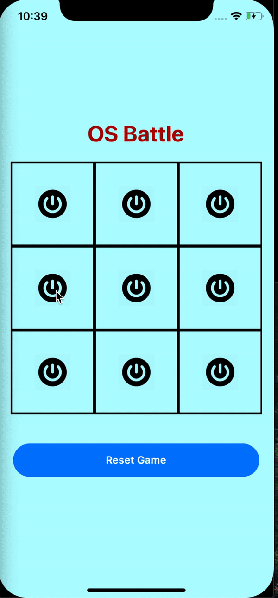

# OS React-Native Tic Tac Toe App

### Inspiration

This project was a project that I did while learning how to make mobile apps using React-Native. The course is from https://www.udemy.com/complete-react-native-bootcamp/. 
While the original design of this app used X's and O's, I wanted to do something a bit different for fun. So I decided to make it using Apple's and Google's icons.

Here's a demo:

